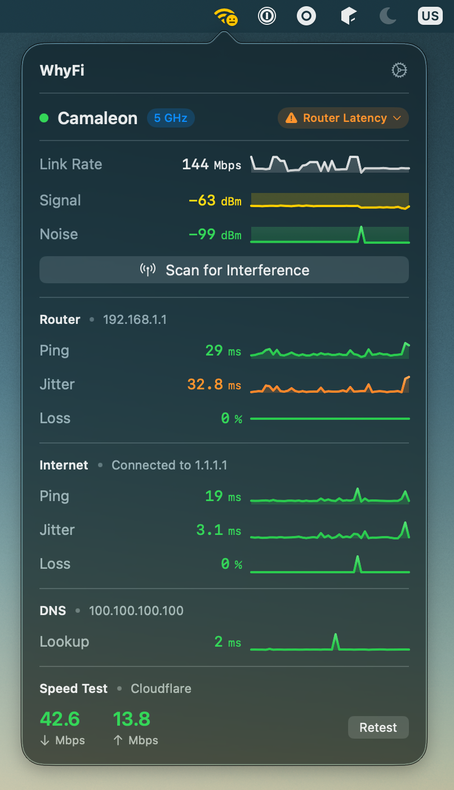
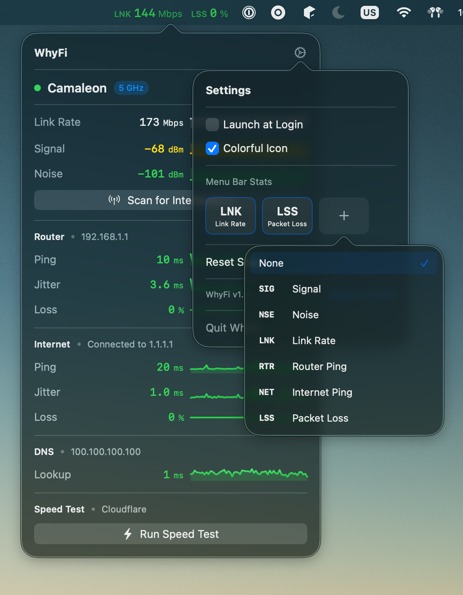
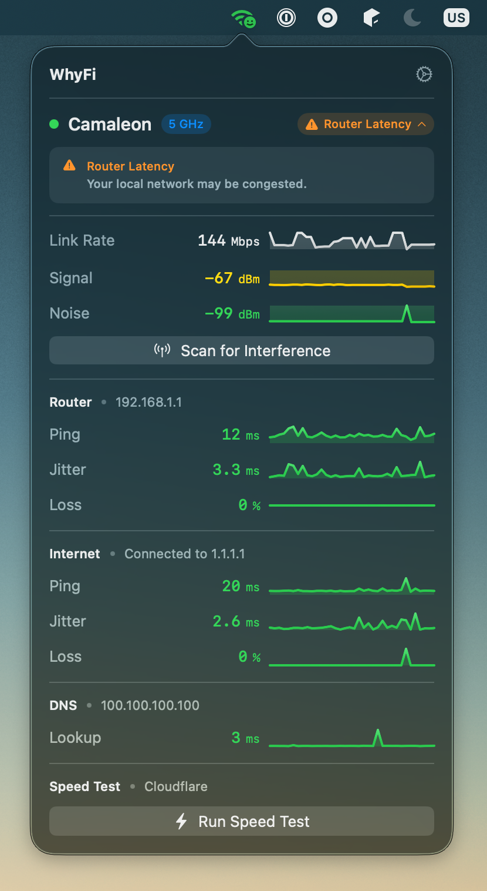
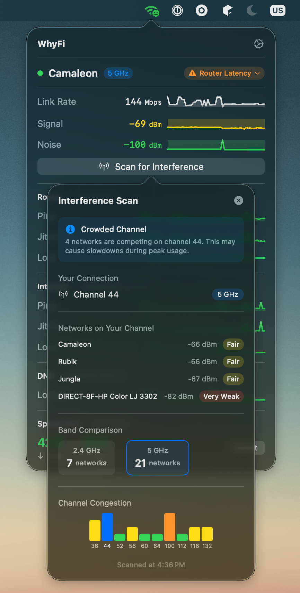

# WhyFi

A free, open-source macOS menu bar app for real-time WiFi network diagnostics.

**[whyfi.dev](https://whyfi.dev)**

<p align="center">
  
</p>

## About

Ever wondered why your WiFi feels slow? WhyFi lives in your menu bar and gives you instant visibility into your network's health. Monitor signal strength, latency, packet loss, and more, all updated in real-time with sparkline graphs showing trends over the last minute.

Whether you're troubleshooting connectivity issues, finding the best spot in your house for your laptop, or just curious about your network performance, WhyFi has you covered.

## What it monitors

- **WiFi Signal** — RSSI, noise floor, and link rate
- **Router** — Ping latency, jitter, and packet loss to your gateway
- **Internet** — Connection quality to Cloudflare's 1.1.1.1
- **DNS** — Lookup response times
- **Speed Test** — Download and upload speeds via Cloudflare

## Screenshots

<p align="center">
  
</p>
<p align="center"><em>Configurable menu bar stats</em></p>

<p align="center">
  
</p>
<p align="center"><em>Actionable tips based on signal quality</em></p>

<p align="center">
  
</p>
<p align="center"><em>Scan for WiFi interference and channel congestion</em></p>

## Requirements

- macOS 14.0 or later
- Location Services permission (required by macOS to access WiFi network information)

## Installation

Clone the repository and open the project in Xcode:

```bash
git clone https://github.com/rmonvfer/WhyFi.git
cd WhyFi
open WhyFi.xcodeproj
```

Build and run with `Cmd+R`, or download a pre-built release from the [Releases](https://github.com/rmonvfer/WhyFi/releases) page.

## Why Location Services?

Starting with macOS Sonoma, Apple requires apps to have Location Services permission to read WiFi network details like SSID and signal strength. WhyFi does not collect, store, or transmit your location data.

## Contributing

Contributions are welcome! Feel free to open issues or submit pull requests.

## License

MIT
